# Architecture

Two views: the **high-level flow** (what happens to a submitted document) and the
**low-level flow** (the contracts and code paths). The guiding principle is in
[README.md](README.md) §2 — every method is a pluggable `Detector`, ranked by a
harness on measured performance.

---

## 1. High-level flow

```mermaid
flowchart TD
    A[Raw submission<br/>PDF / photo / structured JSON] --> R{routing.route_path}
    R -->|PDF| X[Extraction route<br/>NOT YET WIRED]
    R -->|IMAGE| X
    R -->|STRUCTURED| RC[Receipt<br/>normalised fields]
    X -.planned: OCR/VLM.-> RC

    RC --> D[default_detectors&#40;&#41;<br/>run each Detector independently]

    subgraph DET[Detectors -- each emits one Signal]
      D1[arithmetic<br/>field reconciliation]
      D2[tax_id<br/>GSTIN/VAT checksum]
      D3[date_sanity<br/>future / very old]
      D4[duplicate<br/>resubmission match]
      D5[pdf_meta<br/>PDF provenance]
      D6[image forensics<br/>PLANNED, weak signal]
    end
    D --> DET

    DET --> F[Fuser<br/>noisy-OR risk + decision]
    F --> V[Verdict<br/>risk_score, APPROVE/REVIEW/REJECT, reasons]

    DET -. offline .-> H[eval.harness.evaluate<br/>ranks detectors on a labelled set]
    H --> SEL[Leaderboard = the selector]
```



**Two evaluation paths feed the design:**
- `eval.harness.evaluate(dataset, detectors, fuser)` → ranked `Report` (AUC,
  per-subtype recall, FP) on a **labelled** set. This is *how methods are chosen.*
- `eval.audit.audit_false_positives(receipts, detectors, fuser)` → FP report on a
  corpus assumed **all-legitimate** (real receipts). This measures real-world
  false-positive cost, the one thing synthetic data cannot.

---

## 2. Low-level flow

### 2.1 Routing — `routing.py`
`route_path(path)` / `route_bytes(data)` classify input into a `DocumentType`
(`PDF` / `IMAGE` / `STRUCTURED`) by extension first, then magic bytes
(`%PDF-`, JPEG `FF D8 FF`, PNG signature, or a leading `{`/`[` for JSON). PDFs and
photos are deliberately routed apart so each gets its own provenance forensics
(PDF structure vs. image EXIF). **Only the routing decision lives here**; the
extractors and route-specific detectors plug in behind it.

### 2.2 Extraction — *not yet wired (the gap)*
This stage turns a PDF/photo into a `Receipt`. Today only the **STRUCTURED** route
is live (`slipguard score` reads a `Receipt` JSON); PDF/IMAGE inputs raise an
explicit "extraction route not yet wired" error. The plan (OCR/VLM) is in
[ROADMAP.md](ROADMAP.md). The real-data audit currently bypasses this gap by using
WildReceipt's human KIE annotations as an **oracle extractor** (`data/wildreceipt.py`).

### 2.3 The `Receipt` contract — `models.py`
The normalised unit every detector reads. Key fields: `vendor_name`, `date`,
`currency`, `country` (drives tax-id locale), `vendor_tax_id`, `line_items`
(`description, quantity, unit_price, amount`), `subtotal`, `tax_rate`,
`tax_amount`, `total`, `source` (`DocumentType`), `source_path` (the original file
on disk, for provenance forensics). Produced by the synthetic generator, a real
loader, or (later) an extractor — detectors don't care which.

### 2.4 The `Detector` contract — `detectors/base.py`
```python
class Detector(ABC):
    name: str                       # stable id in reports/config
    targets: frozenset[FraudType]   # subtypes it is built to catch (per-subtype scoring)
    applies_to: tuple[DocumentType] | None   # route gate; None = any route

    def applicable(self, receipt) -> bool      # route check
    def prime(self, history) -> None           # optional: seed relational state (duplicate)
    def score(self, receipt) -> Signal         # the actual judgement (abstract)
    def run(self, receipt) -> Signal           # shared entry: gate by route, else score()
    def _abstain(self, reason) -> Signal        # Signal(score=0, confidence=0)
```
`run()` is the single entry point used by both the harness and the CLI: it gates by
document route, then calls `score()`. A detector that lacks the data to judge must
return `_abstain(...)` rather than guess.

### 2.5 The `Signal` + abstention semantics — `models.py`
A `Signal` carries `score` (P(fraud) ∈ [0,1]), `confidence` ∈ [0,1], `reasons`,
and `evidence`.
- `weighted = score · confidence`
- `confidence == 0` ⇒ **abstained**: the detector had nothing to say and **must not
  move the verdict**. `effective_score` returns 0 in that case.

This is the mechanism that lets us run every detector on every receipt without
irrelevant ones polluting the risk score (e.g. `tax_id` abstains on a US receipt;
`pdf_meta` abstains on a photo).

### 2.6 The five current detectors

| Detector | Reads | Flags when | Abstains when |
|---|---|---|---|
| **arithmetic** | line items, subtotal, tax, total | `amount ≠ qty·price`, `subtotal ≠ Σlines`, `tax ≠ rate·subtotal`, `total ≠ subtotal+tax` (tol: max(0.02, 1%)) | can't reconcile (no items and no subtotal+total) |
| **tax_id** | `country`, `vendor_tax_id` | GSTIN/VAT fails format/checksum (`python-stdnum`) | unsupported country or no tax-id |
| **date_sanity** | `date` | future date (0.92), or > 5y old (0.6, weak) | no date |
| **duplicate** | `vendor`, `date`, `total` vs primed history | exact (vendor,date,total) match, or fuzzy vendor + same date + ~amount | no total |
| **pdf_meta** | `source_path` (PDF bytes) | incremental update (extra `%%EOF`), editor tag in `/Producer`·`/Creator`, or ModDate ≫ CreationDate | non-PDF route, no source file |

Each is single-purpose by design: it scores high on *its* subtype and abstains or
scores low elsewhere — which is why a single detector's overall AUC is ~0.625 on a
4-subtype benchmark, and fusion is what produces a usable verdict.

### 2.7 Fusion — `fusion.py`
Baseline **noisy-OR** over confidence-weighted signals:

```
risk = 1 − Π (1 − weightedᵢ)      # skipping abstained signals
```

Independent fraud signals compound; abstainers (weighted 0) can't move it.
Thresholds: `risk ≥ 0.85 → REJECT`, `risk ≥ 0.4 → REVIEW`, else `APPROVE`.
Deliberately simple and **replaceable by a learned/calibrated fuser** once the
harness gives us measured per-detector performance to fit on (see ROADMAP).

### 2.8 Evaluation — `eval/`
- `metrics.py` — dependency-free precision / recall / F1 / ROC-AUC / FPR.
- `harness.py` — `evaluate()` runs each detector independently (AUC, target-subtype
  recall, FP), then the fused verdict (AUC, P/R/F1, FP, decision counts, per-subtype
  recall), returning a printable `Report` leaderboard. **This is the selector.**
- `audit.py` — `audit_false_positives()` runs detectors+fuser over an all-legitimate
  corpus and reports fused FP rate, per-detector abstain/flag rates, extractor field
  coverage, and a categorised breakdown of *why* `arithmetic` fired (lossy extraction
  vs. genuine contradiction). Backs `slipguard eval-real`.

### 2.9 Forensics — `forensics/pdf.py`
`inspect_pdf(bytes_or_path)` → `PdfProvenance` (eof_count, producer, creator,
creation/mod dates, matched editor tag, date-gap days). **Dependency-free**: raw
bytes + regex over the literal Info dict. It never raises. Limitation: it does *not*
yet decode xref-stream / compressed / XMP metadata (those need pikepdf/pdfid); on
such PDFs the string fields read `None` while the `%%EOF` count stays reliable.

---

## 3. Module map

```
src/slipguard/
  models.py               Receipt, LineItem, Signal, Verdict, LabeledSample; enums
  routing.py              route_path / route_bytes -> DocumentType
  fusion.py               Fuser: noisy-OR risk + APPROVE/REVIEW/REJECT
  cli.py / __main__.py    eval | eval-pdf | eval-real | score
  detectors/
    base.py               Detector ABC (applicable/prime/score/run/_abstain)
    arithmetic.py         line items -> subtotal -> tax -> total reconciliation
    taxid.py              python-stdnum GSTIN (IN) + EU VAT; abstains if unsupported
    datesanity.py         future / implausibly-old dates (today injectable)
    duplicate.py          exact + fuzzy resubmission match; prime()-d with history
    pdfmeta.py            PDF provenance signal (reads forensics.inspect_pdf)
    __init__.py           default_detectors() — the canonical ranked set
  forensics/
    pdf.py                dependency-free PDF provenance inspector
  data/
    synth.py              synthetic structured clean+fraud generator
    pdfsynth.py           synthetic PDF generator (byte layout) + 3 provenance tampers
    wildreceipt.py        WildReceipt loader: KIE annotations -> Receipt (oracle, no OCR)
  eval/
    metrics.py            dependency-free precision/recall/F1/AUC/FPR
    harness.py            evaluate() -> ranked Report (leaderboard / selector)
    audit.py              audit_false_positives() -> FP report on legitimate corpus
tests/                    43 tests
```

---

## 4. How to add a detection method

1. Create `detectors/<name>.py` with a `Detector` subclass: set `name`, `targets`,
   and `applies_to` (e.g. `(DocumentType.IMAGE,)` for image-only forensics; omit for
   any route). Implement `score()`; return `self._abstain(reason)` when you lack the
   data. Override `prime(history)` only if relational.
2. Add an instance to `default_detectors()` in `detectors/__init__.py`.
3. Add ground truth for its subtype to a generator/loader so the harness can score it.
4. Add tests. Run `slipguard eval` — the new row appears in the leaderboard.

Fusion and the harness consume any `Detector` uniformly; nothing else changes.

---

## 5. Worked example — scoring one structured receipt (low-level)

```
slipguard score data/demo.json
  └─ routing.route_path(".json") = STRUCTURED
  └─ Receipt.from_dict(json)               # normalise into the shared contract
  └─ for d in default_detectors(): d.run(receipt)
        arithmetic  -> Signal(score, conf, reasons)        # reconciles fields
        tax_id      -> Signal or _abstain                  # by country
        date_sanity -> Signal                              # future/old/plausible
        duplicate   -> Signal or _abstain                  # vs primed history (none here)
        pdf_meta    -> _abstain                             # not a PDF route
  └─ Fuser().verdict(doc_id, signals)
        risk = 1 - Π(1 - score·conf)  over non-abstained
        decision = REJECT if risk≥0.85 elif REVIEW if risk≥0.4 else APPROVE
  └─ print risk, decision, and [detector] reasons
```
