# Architecture

Two views: the **high-level flow** (what happens to a submitted document) and the
**low-level flow** (the contracts and code paths). The guiding principle is in
[README.md](README.md) §2 — every method is a pluggable `Detector`, ranked by a
harness on measured performance.

---

## 1. High-level flow

```mermaid
flowchart TD
    A[Raw submission<br/>PDF / photo / structured JSON] --> R{routing.route_path}
    R -->|PDF| XP[Extractor route<br/>OCR/VLM — planned]
    R -->|IMAGE| XV[VLM extractor<br/>Qwen2-VL-2B — live]
    R -->|STRUCTURED| SE[StructuredExtractor<br/>live]
    SE --> RC[Receipt<br/>normalised fields]
    XV --> RC
    XP -.planned.-> RC

    RC --> D[default_detectors&#40;&#41;<br/>run each Detector independently]

    subgraph DET[Detectors -- each emits one Signal]
      D1[arithmetic<br/>field reconciliation]
      D2[tax_id<br/>GSTIN/VAT checksum]
      D3[date_sanity<br/>future / very old]
      D4[duplicate<br/>resubmission match]
      D5[pdf_meta<br/>PDF provenance]
      D6[image_meta<br/>image EXIF provenance]
      D7[image pixel forensics<br/>PLANNED, weak signal]
    end
    D --> DET

    DET --> F[Fuser<br/>noisy-OR risk + decision]
    F --> V[Verdict<br/>risk_score, APPROVE/REVIEW/REJECT, reasons]

    DET -. offline .-> H[eval.harness.evaluate<br/>ranks detectors on a labelled set]
    H --> SEL[Leaderboard = the selector]
```



**Three evaluation paths feed the design:**
- `eval.harness.evaluate(dataset, detectors, fuser)` → ranked `Report` (AUC,
  per-subtype recall, FP) on a **labelled** set. This is *how detectors are chosen.*
- `eval.audit.audit_false_positives(receipts, detectors, fuser)` → FP report on a
  corpus assumed **all-legitimate** (real receipts). This measures real-world
  false-positive cost, the one thing synthetic data cannot.
- `eval.extraction.evaluate_extractors(extractors, truths)` → field-level accuracy
  leaderboard against the WildReceipt KIE **oracle** as ground truth. This is *how
  extractors are chosen* — the same measured-not-opinion rule, applied to extraction.

---

## 2. Low-level flow

### 2.1 Routing — `routing.py`
`route_path(path)` / `route_bytes(data)` classify input into a `DocumentType`
(`PDF` / `IMAGE` / `STRUCTURED`) by extension first, then magic bytes
(`%PDF-`, JPEG `FF D8 FF`, PNG signature, or a leading `{`/`[` for JSON). PDFs and
photos are deliberately routed apart so each gets its own provenance forensics
(PDF structure vs. image EXIF). **Only the routing decision lives here**; the
extractors and route-specific detectors plug in behind it.

### 2.2 Extraction — `extractors/` (STRUCTURED + IMAGE live; PDF pending)
This stage turns a raw document into a `Receipt`. Every approach implements one
**`Extractor`** contract (mirroring `Detector`): `name`, `handles` (routes), and
`extract(path) -> Receipt`. `extractor_for(route)` picks the registered extractor,
and `slipguard score` runs **route → extractor → detectors** uniformly. The
dependency-free **`StructuredExtractor`** (reads a `Receipt` JSON) backs the STRUCTURED
route; the IMAGE route has **two** benchmarked extractors: the **`QwenVLExtractor`**
(`vlm_qwen.py`, default Qwen2-VL-2B-Instruct, apache-2.0) prompts a VLM to emit the
`Receipt` schema as JSON (loads via transformers Auto classes — any HF VLM is a swappable
`--model` candidate), and the **`DocTROCRExtractor`** (`doctr_ocr.py`, Apache-2.0) runs a
two-stage OCR (text detection+recognition) feeding a transparent keyword/position KIE.
Both keep torch/transformers/PIL/doctr imports lazy so the package stays import-light. The
**PDF route** still returns an explicit "no extractor registered" until an OCR/VLM PDF
extractor lands (plan in [ROADMAP.md](ROADMAP.md)). Extractors are ranked head-to-head on
field accuracy by `eval/extraction.py`: on the same 100 receipts **Qwen2-VL-2B leads at
macro 0.725, docTR second at 0.579** (so the IMAGE route ships the VLM — by the numbers).
docTR's OCR is sound (it ties the VLM on date at 0.915 and *beats* it on `total`); a
**row-merge** pre-pass (`_merge_rows`) was needed first because docTR emits a row's label
and its right-column amount as separate lines — without it the single-line KIE scored a
misleading 0.244, an own-pipeline bug, not an OCR limit.

An extractor may set per-field confidence on the Receipt (`field_confidence`);
`arithmetic` reads it and **abstains** when the money fields it needs were read
below a confidence floor, so a misread no longer masquerades as fraud. The Qwen VLM
supplies **two** honest confidence signals. (1) A **parse-completeness** confidence for
`line_items` (the fraction of emitted items it could parse), which **arms** the guard on
the under-capture case the audit named: a low ratio makes `arithmetic` abstain on a
`subtotal ≠ Σlines` gap that is really a capture artifact rather than fraud. (2) A
**per-token-logprob** confidence on the scalar money fields (`subtotal`, `tax_amount`,
`total`): the same greedy decode emits per-token probabilities
(`compute_transition_scores`), and the least-confident digit of each value becomes its
confidence — free, riding the one pass with no extra inference. Honest verdict, measured in
two steps. At the principled **0.5** abstain floor the logprob signal does **not** lower the
audit FP — it catches only 18% of misreads, which clear the floor — and that first read as
"the misreads are simply confident." But the calibration study (`eval/calibration.py`,
`eval-calibration`; 222 scored money reads on the same 100 receipts) shows the signal is **far
from uninformative**: **AUC 0.758** that a read disagrees with the oracle (0.77–0.83 per field),
with a **monotonic reliability curve** — accuracy 0.37 below 0.6, 0.71 in [0.8, 0.9), 0.87 in
[0.9, 1.0). So the *signal* is genuinely good; the *0.5 threshold* was just too low. There is no
free lunch — every abstain threshold trades misread-recall for dropped-correct reads (T=0.7:
51% of misreads caught, 17% of good reads dropped), and the arithmetic-breaking misreads skew
confident — so its proper home is a **cost-aware learned fuser** (M3) that weighs this per-value
feature against the cost of a needless abstain, not a hand-set floor. (Parse-completeness has its
own complementary blind spot: it sees *emitted-but-unparseable* loss only, not items the model
never emitted.) The real-data audit uses WildReceipt's human KIE annotations as an **oracle extractor**
(`data/wildreceipt.py`) whose fields carry no confidence and so read as trusted; the audit's
**0.364** arithmetic FP only drops once an extractor supplies low confidence on the boxes
*it* misreads.

### 2.3 The `Receipt` contract — `models.py`
The normalised unit every detector reads. Key fields: `vendor_name`, `date`,
`currency`, `country` (drives tax-id locale), `vendor_tax_id`, `line_items`
(`description, quantity, unit_price, amount`), `subtotal`, `tax_rate`,
`tax_amount`, `total`, `source` (`DocumentType`), `source_path` (the original file
on disk, for provenance forensics). Produced by the synthetic generator, a real
loader, or (later) an extractor — detectors don't care which.

### 2.4 The `Detector` contract — `detectors/base.py`
```python
class Detector(ABC):
    name: str                       # stable id in reports/config
    targets: frozenset[FraudType]   # subtypes it is built to catch (per-subtype scoring)
    applies_to: tuple[DocumentType] | None   # route gate; None = any route

    def applicable(self, receipt) -> bool      # route check
    def prime(self, history) -> None           # optional: seed relational state (duplicate)
    def score(self, receipt) -> Signal         # the actual judgement (abstract)
    def run(self, receipt) -> Signal           # shared entry: gate by route, else score()
    def _abstain(self, reason) -> Signal        # Signal(score=0, confidence=0)
```
`run()` is the single entry point used by both the harness and the CLI: it gates by
document route, then calls `score()`. A detector that lacks the data to judge must
return `_abstain(...)` rather than guess.

### 2.5 The `Signal` + abstention semantics — `models.py`
A `Signal` carries `score` (P(fraud) ∈ [0,1]), `confidence` ∈ [0,1], `reasons`,
and `evidence`.
- `weighted = score · confidence`
- `confidence == 0` ⇒ **abstained**: the detector had nothing to say and **must not
  move the verdict**. `effective_score` returns 0 in that case.

This is the mechanism that lets us run every detector on every receipt without
irrelevant ones polluting the risk score (e.g. `tax_id` abstains on a US receipt;
`pdf_meta` abstains on a photo).

### 2.6 The six current detectors

| Detector | Reads | Flags when | Abstains when |
|---|---|---|---|
| **arithmetic** | line items, subtotal, tax, total, `field_confidence` | `amount ≠ qty·price`, `subtotal ≠ Σlines`, `tax ≠ rate·subtotal`, `total ≠ subtotal+tax` (tol: max(0.02, 1%)) | can't reconcile (no items and no subtotal+total), **or** money fields below the confidence floor |
| **tax_id** | `country`, `vendor_tax_id` | GSTIN/VAT fails format/checksum (`python-stdnum`) | unsupported country or no tax-id |
| **date_sanity** | `date` | future date (0.92), or > 5y old (0.6, weak) | no date |
| **duplicate** | `vendor`, `date`, `total` vs primed history | exact (vendor,date,total) match, or fuzzy vendor + same date + ~amount | no total |
| **pdf_meta** | `source_path` (PDF bytes) | incremental update (extra `%%EOF`), editor tag in `/Producer`·`/Creator`, or ModDate ≫ CreationDate | non-PDF route, no source file |
| **image_meta** | `source_path` (image EXIF, via Pillow) | image editor in EXIF `Software` (Photoshop/GIMP/…), or `DateTime` ≫ `DateTimeOriginal` (capture-vs-modify gap) | non-IMAGE route, no source file, Pillow absent, or **no EXIF** (stripped/screenshot/AI — not guilt) |

Each is single-purpose by design: it scores high on *its* subtype and abstains or
scores low elsewhere — which is why a single detector's overall AUC is ~0.625 on a
4-subtype benchmark, and fusion is what produces a usable verdict.

### 2.7 Fusion — `fusion.py`
Baseline **noisy-OR** over confidence-weighted signals:

```
risk = 1 − Π (1 − weightedᵢ)      # skipping abstained signals
```

Independent fraud signals compound; abstainers (weighted 0) can't move it. The
formula itself lives once in `combine.noisy_or` and is reused by `pdf_meta` and
`image_meta` to combine their own provenance sub-signals — same rule, two levels.
Thresholds: `risk ≥ 0.85 → REJECT`, `risk ≥ 0.4 → REVIEW`, else `APPROVE`.
Deliberately simple and **replaceable by a learned/calibrated fuser** once the
harness gives us measured per-detector performance to fit on (see ROADMAP).

### 2.8 Evaluation — `eval/`
- `metrics.py` — dependency-free precision / recall / F1 / ROC-AUC / FPR.
- `harness.py` — `evaluate()` runs each detector independently (AUC, target-subtype
  recall, FP), then the fused verdict (AUC, P/R/F1, FP, decision counts, per-subtype
  recall), returning a printable `Report` leaderboard. **This is the selector.**
- `audit.py` — `audit_false_positives()` runs detectors+fuser over an all-legitimate
  corpus and reports fused FP rate, per-detector abstain/flag rates, extractor field
  coverage, and a categorised breakdown of *why* `arithmetic` fired (lossy extraction
  vs. genuine contradiction). Backs `slipguard eval-real`.
- `extraction.py` — `evaluate_extractors()` ranks extractors by field-level accuracy
  (vendor / date / subtotal / tax / total / line-count) against the WildReceipt oracle:
  the oracle Receipt is the reference, a candidate OCR/VLM extractor's output is the
  prediction, and a field is scored only when the oracle has a value for it. Money uses
  the same tolerance as `arithmetic`; vendor uses the duplicate detector's normaliser.
  Backs `slipguard eval-extract`. **This is the extractor selector**, mirroring `harness.py`.

### 2.9 Forensics — `forensics/pdf.py`, `forensics/image.py`
`inspect_pdf(bytes_or_path)` → `PdfProvenance` (eof_count, producer, creator,
creation/mod dates, matched editor tag, date-gap days). **Dependency-free**: raw
bytes + regex over the literal Info dict. It never raises. Limitation: it does *not*
yet decode xref-stream / compressed / XMP metadata (those need pikepdf/pdfid); on
such PDFs the string fields read `None` while the `%%EOF` count stays reliable.

`inspect_image(path)` → `ImageProvenance` (has_exif, software, make/model, capture &
modify timestamps, matched editor tag, date-gap days) — the EXIF sibling of the PDF
inspector. Uses **Pillow** (the `[vlm]` extra), imported lazily; `pillow_available()`
lets the detector gate on it without importing. Reads `Software` (0x0131),
`DateTime` (0x0132) and `DateTimeOriginal` (0x9003, in the Exif sub-IFD). Never raises
on a non-image / EXIF-less file (returns `has_exif=False`). Design choice: **missing
EXIF is not guilt** — it is common in legitimate shared receipts as well as
stripped/AI images — so the detector abstains rather than accuses.

---

## 3. Module map

```
src/slipguard/
  models.py               Receipt, LineItem, Signal, Verdict, LabeledSample; enums
  routing.py              route_path / route_bytes -> DocumentType
  combine.py              noisy_or(): the shared probability-combination rule
  money.py                parse_money(): shared US/EU-aware money parser (oracle + VLM extractor)
  fusion.py               Fuser: noisy-OR risk + APPROVE/REVIEW/REJECT
  cli.py / __main__.py    eval | eval-pdf | eval-image | eval-real | eval-extract | score
  extractors/
    base.py               Extractor ABC (handles / can_handle / extract -> Receipt)
    structured.py         StructuredExtractor: Receipt JSON -> Receipt (dependency-free)
    vlm_qwen.py           QwenVLExtractor: image -> Receipt via Qwen2-VL (lazy torch/transformers)
    __init__.py           default_extractors() + extractor_for(route) registry
  detectors/
    base.py               Detector ABC (applicable/prime/score/run/_abstain)
    arithmetic.py         line items -> subtotal -> tax -> total reconciliation
    taxid.py              python-stdnum GSTIN (IN) + EU VAT; abstains if unsupported
    datesanity.py         future / implausibly-old dates (today injectable)
    duplicate.py          exact + fuzzy resubmission match; prime()-d with history
    pdfmeta.py            PDF provenance signal (reads forensics.inspect_pdf)
    imagemeta.py          image EXIF provenance signal (reads forensics.inspect_image)
    __init__.py           default_detectors() — the canonical ranked set
  forensics/
    pdf.py                dependency-free PDF provenance inspector
    image.py              image EXIF provenance inspector (Pillow, lazy)
  data/
    synth.py              synthetic structured clean+fraud generator
    pdfsynth.py           synthetic PDF generator (byte layout) + 3 provenance tampers
    imagesynth.py         synthetic image generator (real EXIF JPEGs) + 2 provenance tampers
    wildreceipt.py        WildReceipt loader: KIE annotations -> Receipt (oracle, no OCR)
  eval/
    metrics.py            dependency-free precision/recall/F1/AUC/FPR
    harness.py            evaluate() -> ranked Report (detector leaderboard / selector)
    audit.py              audit_false_positives() -> FP report on legitimate corpus
    extraction.py         evaluate_extractors() -> field-accuracy leaderboard vs oracle
    calibration.py        summarize_calibration() -> does per-value confidence predict a misread?
tests/                    151 tests
```

---

## 4. How to add a detection method

1. Create `detectors/<name>.py` with a `Detector` subclass: set `name`, `targets`,
   and `applies_to` (e.g. `(DocumentType.IMAGE,)` for image-only forensics; omit for
   any route). Implement `score()`; return `self._abstain(reason)` when you lack the
   data. Override `prime(history)` only if relational.
2. Add an instance to `default_detectors()` in `detectors/__init__.py`.
3. Add ground truth for its subtype to a generator/loader so the harness can score it.
4. Add tests. Run `slipguard eval` — the new row appears in the leaderboard.

Fusion and the harness consume any `Detector` uniformly; nothing else changes.

**Adding an extraction approach** has the same shape: subclass `Extractor`
(`name`, `handles`, `extract(path) -> Receipt`), set `field_confidence` for
uncertain fields, and register it in `default_extractors()`. `extractor_for(route)`
and `slipguard score` pick it up with no other changes.

---

## 5. Worked example — scoring one structured receipt (low-level)

```
slipguard score data/demo.json
  └─ routing.route_path(".json") = STRUCTURED
  └─ extractor_for(STRUCTURED).extract(path) -> Receipt   # StructuredExtractor (from_dict)
  └─ for d in default_detectors(): d.run(receipt)
        arithmetic  -> Signal(score, conf, reasons)        # reconciles fields
        tax_id      -> Signal or _abstain                  # by country
        date_sanity -> Signal                              # future/old/plausible
        duplicate   -> Signal or _abstain                  # vs primed history (none here)
        pdf_meta    -> _abstain                             # not a PDF route
  └─ Fuser().verdict(doc_id, signals)
        risk = 1 - Π(1 - score·conf)  over non-abstained
        decision = REJECT if risk≥0.85 elif REVIEW if risk≥0.4 else APPROVE
  └─ print risk, decision, and [detector] reasons
```
