# Architecture

Two views: the **high-level flow** (what happens to a submitted document) and the
**low-level flow** (the contracts and code paths). The guiding principle is in
[README.md](README.md) §2 — every method is a pluggable `Detector`, ranked by a
harness on measured performance.

---

## 1. High-level flow

```mermaid
flowchart TD
    A[Raw submission<br/>PDF / photo / structured JSON] --> R{routing.route_path}
    R -->|PDF| XP[PdfTextExtractor<br/>born-digital text — live]
    R -->|IMAGE| XV[VLM extractor<br/>Qwen2-VL-2B — live]
    R -->|STRUCTURED| SE[StructuredExtractor<br/>live]
    SE --> RC[Receipt<br/>normalised fields]
    XV --> RC
    XP --> RC

    RC --> D[default_detectors&#40;&#41;<br/>run each Detector independently]

    subgraph DET[Detectors -- each emits one Signal]
      D1[arithmetic<br/>field reconciliation]
      D2[tax_id<br/>GSTIN/VAT checksum]
      D3[date_sanity<br/>future / out-of-window 60d]
      D4[duplicate<br/>resubmission match]
      D5[pdf_meta<br/>PDF provenance]
      D6[image_meta<br/>image EXIF + C2PA provenance]
      D7[image pixel forensics<br/>DEFERRED #60, weak signal]
    end
    D --> DET

    DET --> F[Fuser<br/>noisy-OR risk default / learned combiner opt-in + decision]
    F --> V[Verdict<br/>risk_score, APPROVE/REVIEW/REJECT, reasons]

    DET -. offline .-> H[eval.harness.evaluate<br/>ranks detectors on a labelled set]
    H --> SEL[Leaderboard = the selector]
```



**Three evaluation paths feed the design:**
- `eval.harness.evaluate(dataset, detectors, fuser)` → ranked `Report` (AUC,
  per-subtype recall, FP) on a **labelled** set. This is *how detectors are chosen.*
- `eval.audit.audit_false_positives(receipts, detectors, fuser)` → FP report on a
  corpus assumed **all-legitimate** (real receipts). This measures real-world
  false-positive cost, the one thing synthetic data cannot.
- `eval.extraction.evaluate_extractors(extractors, truths)` → field-level accuracy
  leaderboard against the WildReceipt KIE **oracle** as ground truth. This is *how
  extractors are chosen* — the same measured-not-opinion rule, applied to extraction.

---

## 2. Low-level flow

### 2.1 Routing — `routing.py`
`route_path(path)` / `route_bytes(data)` classify input into a `DocumentType`
(`PDF` / `IMAGE` / `STRUCTURED`) by extension first, then magic bytes
(`%PDF-`, JPEG `FF D8 FF`, PNG signature, or a leading `{`/`[` for JSON). PDFs and
photos are deliberately routed apart so each gets its own provenance forensics
(PDF structure vs. image EXIF). **Only the routing decision lives here**; the
extractors and route-specific detectors plug in behind it.

### 2.2 Extraction — `extractors/` (STRUCTURED + IMAGE + PDF live)
This stage turns a raw document into a `Receipt`. Every approach implements one
**`Extractor`** contract (mirroring `Detector`): `name`, `handles` (routes), and
`extract(path) -> Receipt`. `extractor_for(route)` picks the registered extractor,
and `slipguard score` runs **route → extractor → detectors** uniformly. The
dependency-free **`StructuredExtractor`** (reads a `Receipt` JSON) backs the STRUCTURED
route; the IMAGE route has **two** benchmarked extractors: the **`QwenVLExtractor`**
(`vlm_qwen.py`, default Qwen2-VL-2B-Instruct, apache-2.0) prompts a VLM to emit the
`Receipt` schema as JSON (loads via transformers Auto classes — any HF VLM is a swappable
`--model` candidate), and the **`DocTROCRExtractor`** (`doctr_ocr.py`, Apache-2.0) runs a
two-stage OCR (text detection+recognition) feeding a transparent keyword/position KIE.
Both keep torch/transformers/PIL/doctr imports lazy so the package stays import-light. The
**PDF route** is now live too: **`PdfTextExtractor`** (`pdf_text.py`, pypdfium2,
Apache-2.0/BSD-3-Clause) reads a born-digital PDF's **embedded text layer** — pypdfium2
returns one rect per line in PDF points (bottom-left origin), which `_lines_from_rects`
maps into the shared KIE's page-fraction `Line` contract (`y = 1 − top/height`,
`x = left/width`) at **confidence 1.0** (exact text, not OCR). Honest limit: it reads the
text layer only, so a **scanned-image PDF** (no text layer) yields an empty Receipt and
belongs on the IMAGE/OCR route — rasterise-then-OCR is future work ([ROADMAP.md](ROADMAP.md)).
This is the payoff of factoring the KIE out of docTR into **`kie.py`** (`receipt_from_lines`):
the same paradigm-agnostic label/position logic now serves OCR boxes *and* PDF text rects, so
a born-digital PDF scores end-to-end (arithmetic / tax_id / date_sanity / duplicate now run on
it, not just `pdf_meta`). Extractors are ranked head-to-head on
field accuracy by `eval/extraction.py`: on the same 100 receipts **Qwen2-VL-2B leads at
macro 0.725, docTR second at 0.579** (so the IMAGE route ships the VLM — by the numbers).
The PDF route is measured on its own minted oracle (`eval-pdf-extract`): a known Receipt is
rendered to a real text PDF and read back, scoring **macro 0.992** (date / subtotal / tax /
total / line-count all 1.000; **vendor 0.950**, the only miss — see §2.2.1).
docTR's OCR is sound (it ties the VLM on date at 0.915 and *beats* it on `total`); a
**row-merge** pre-pass (`_merge_rows`) was needed first because docTR emits a row's label
and its right-column amount as separate lines — without it the single-line KIE scored a
misleading 0.244, an own-pipeline bug, not an OCR limit.

An extractor may set per-field confidence on the Receipt (`field_confidence`);
`arithmetic` reads it and **abstains** when the money fields it needs were read
below a confidence floor, so a misread no longer masquerades as fraud. The Qwen VLM
supplies **two** honest confidence signals. (1) A **parse-completeness** confidence for
`line_items` (the fraction of emitted items it could parse), which **arms** the guard on
the under-capture case the audit named: a low ratio makes `arithmetic` abstain on a
`subtotal ≠ Σlines` gap that is really a capture artifact rather than fraud. (2) A
**per-token-logprob** confidence on the scalar money fields (`subtotal`, `tax_amount`,
`total`): the same greedy decode emits per-token probabilities
(`compute_transition_scores`), and the least-confident digit of each value becomes its
confidence — free, riding the one pass with no extra inference. Honest verdict, measured in
two steps. At the principled **0.5** abstain floor the logprob signal does **not** lower the
audit FP — it catches only 18% of misreads, which clear the floor — and that first read as
"the misreads are simply confident." But the calibration study (`eval/calibration.py`,
`eval-calibration`; 222 scored money reads on the same 100 receipts) shows the signal is **far
from uninformative**: **AUC 0.758** that a read disagrees with the oracle (0.77–0.83 per field),
with a **monotonic reliability curve** — accuracy 0.37 below 0.6, 0.71 in [0.8, 0.9), 0.87 in
[0.9, 1.0). So the *signal* is genuinely good; the *0.5 threshold* was just too low. There is no
free lunch — every abstain threshold trades misread-recall for dropped-correct reads (T=0.7:
51% of misreads caught, 17% of good reads dropped), and the arithmetic-breaking misreads skew
confident — so its proper home is a **cost-aware learned fuser** (M3) that weighs this per-value
feature against the cost of a needless abstain, not a hand-set floor. (Parse-completeness has its
own complementary blind spot: it sees *emitted-but-unparseable* loss only, not items the model
never emitted.) The real-data audit uses WildReceipt's human KIE annotations as an **oracle extractor**
(`data/wildreceipt.py`) whose fields carry no confidence and so read as trusted; the audit's
**0.364** arithmetic FP only drops once an extractor supplies low confidence on the boxes
*it* misreads.

#### 2.2.1 Honest read of the PDF route's one miss — a KIE labelling limit, not a read failure
The PDF round-trip's only sub-1.0 field is **vendor (0.950 = 38/40)**. The text is read
*perfectly* — both misses are a **labelling** artifact in the shared KIE, not lost characters.
The vendor heuristic picks the longest alphabetic line in the top band; on a **short** receipt
(few line-items) an item line lands inside that band, and a short store name loses the
letter-count tie — e.g. `truth='Croma'` (5 letters) is out-lettered by an item line
`'Coffee 47.53'` / `'Stapler 6.68'`. So the ceiling here is the **paradigm-agnostic KIE's
vendor rule**, shared with the OCR route — improving it (e.g. weight position over raw length,
or exclude price-shaped lines from the vendor candidates) lifts *both* routes at once. We
**measure** this rather than assert it: the round-trip test deliberately checks only the numeric
fields + date (which survive on every receipt), and the docs report the true cause.

### 2.3 The `Receipt` contract — `models.py`
The normalised unit every detector reads. Key fields: `vendor_name`, `date`,
`currency`, `country` (drives tax-id locale), `vendor_tax_id`, `line_items`
(`description, quantity, unit_price, amount`), `subtotal`, `tax_rate`,
`tax_amount`, `total`, `source` (`DocumentType`), `source_path` (the original file
on disk, for provenance forensics). Produced by the synthetic generator, a real
loader, or (later) an extractor — detectors don't care which.

### 2.4 The `Detector` contract — `detectors/base.py`
```python
class Detector(ABC):
    name: str                       # stable id in reports/config
    targets: frozenset[FraudType]   # subtypes it is built to catch (per-subtype scoring)
    applies_to: tuple[DocumentType] | None   # route gate; None = any route

    def applicable(self, receipt) -> bool      # route check
    def prime(self, history) -> None           # optional: seed relational state (duplicate)
    def score(self, receipt) -> Signal         # the actual judgement (abstract)
    def run(self, receipt) -> Signal           # shared entry: gate by route, else score()
    def _abstain(self, reason) -> Signal        # Signal(score=0, confidence=0)
```
`run()` is the single entry point used by both the harness and the CLI: it gates by
document route, then calls `score()`. A detector that lacks the data to judge must
return `_abstain(...)` rather than guess.

### 2.5 The `Signal` + abstention semantics — `models.py`
A `Signal` carries `score` (P(fraud) ∈ [0,1]), `confidence` ∈ [0,1], `reasons`,
and `evidence`.
- `weighted = score · confidence`
- `confidence == 0` ⇒ **abstained**: the detector had nothing to say and **must not
  move the verdict**. `effective_score` returns 0 in that case.

This is the mechanism that lets us run every detector on every receipt without
irrelevant ones polluting the risk score (e.g. `tax_id` abstains on a US receipt;
`pdf_meta` abstains on a photo).

### 2.6 The six current detectors

| Detector | Reads | Flags when | Abstains when |
|---|---|---|---|
| **arithmetic** | line items, subtotal, tax, total, `field_confidence` | `amount ≠ qty·price`, `subtotal ≠ Σlines`, `tax ≠ rate·subtotal`, `total ≠ subtotal+tax` (tol: max(0.02, 1%)) | can't reconcile (no items and no subtotal+total), **or** money fields below the confidence floor |
| **tax_id** | `country`, `vendor_tax_id` | GSTIN/VAT fails format/checksum (`python-stdnum`) | unsupported country or no tax-id |
| **date_sanity** | `date` | future date (0.92), or > 5y old (0.6, weak) | no date |
| **duplicate** | `vendor`, `date`, `total` vs primed history | exact (vendor,date,total) match, or fuzzy vendor + same date + ~amount | no total |
| **pdf_meta** | `source_path` (PDF bytes; + pikepdf deep layer when `[pdf-forensics]` present) | **L1 bytes:** incremental update (extra `%%EOF`), **`/Prev` object-diff content-edit localization** (which object an update rewrote → page content stream = displayed values edited), **signature `/ByteRange` edit-after-signing**, editor tag in `/Producer`·`/Creator`, ModDate ≫ CreationDate. **L2 pikepdf:** editor tag / date gap from compressed object-stream + XMP, plus structural anomalies — JavaScript, OpenAction, AcroForm (signature-only exempt), overlay annotations. *Disjoint accounting:* correlated sub-signals counted once | non-PDF route, no source file |
| **image_meta** | `source_path` (C2PA manifest via `[c2pa]`; image EXIF via Pillow) | **C2PA:** a signed `trainedAlgorithmicMedia` assertion → AI-generated/edited (a *trustworthy positive*); `digitalCapture` → camera (weak exonerate). **EXIF:** image editor in `Software` (Photoshop/GIMP/…), or `DateTime` ≫ `DateTimeOriginal` gap | non-IMAGE route, no source file, or **neither a C2PA manifest nor EXIF** (stripped/screenshot/AI — not guilt) |

Each is single-purpose by design: it scores high on *its* subtype and abstains or
scores low elsewhere — which is why a single detector's overall AUC is ~0.625 on a
4-subtype benchmark, and fusion is what produces a usable verdict.

### 2.7 Fusion — `fusion.py`
Baseline **noisy-OR** over confidence-weighted signals:

```
risk = 1 − Π (1 − weightedᵢ)      # skipping abstained signals
```

Independent fraud signals compound; abstainers (weighted 0) can't move it. The
formula itself lives once in `combine.noisy_or` and is reused by `pdf_meta` and
`image_meta` to combine their own provenance sub-signals — same rule, two levels.
Thresholds: `risk ≥ 0.85 → REJECT`, `risk ≥ 0.4 → REVIEW`, else `APPROVE`. It needs
no training, so it is the **default**.

**Learned fuser (`fusion_learned.py`, opt-in).** `Fuser` takes an optional
`combiner` callable; when set it replaces the noisy-OR rule while `decide` / `verdict`
/ thresholds stay shared (only the score combination differs). `LearnedFuser` is a
transparent, dependency-free **logistic regression** over the *same* per-detector
weighted signals (one feature per detector = `signal.weighted`, keyed by detector
name; an abstainer contributes 0) — i.e. noisy-OR's inputs with *learned* per-detector
weights instead of an implicit equal one. It exposes `.explain()` (the legible
weights) and is selected by measured numbers (`eval-fusion`), not preference; see
§2.8 and ROADMAP. Honesty: it trains on synthetic positives, so it separates
synthetic-fraud from real-legitimate receipts, and a detector absent from the
training data (e.g. `pdf_meta` on structured data) gets an uninformative weight — so
the learned fuser is route-specific and noisy-OR remains the safe default.

### 2.8 Evaluation — `eval/`
- `metrics.py` — dependency-free precision / recall / F1 / ROC-AUC / FPR.
- `harness.py` — `evaluate()` runs each detector independently (AUC, target-subtype
  recall, FP), then the fused verdict (AUC, P/R/F1, FP, decision counts, per-subtype
  recall), returning a printable `Report` leaderboard. **This is the selector.**
- `audit.py` — `audit_false_positives()` runs detectors+fuser over an all-legitimate
  corpus and reports fused FP rate, per-detector abstain/flag rates, extractor field
  coverage, and a categorised breakdown of *why* `arithmetic` fired (lossy extraction
  vs. genuine contradiction). Backs `slipguard eval-real`, which runs it over any of three
  real corpora via `--corpus {wildreceipt,cord,expressexpense}` (`data/*.py` loaders).
  Two oracle corpora make the result robust: WildReceipt (US KIE) FP **0.364** traces to
  *lossy extraction*, while CORD (Indonesian gt_parse, clean labels) FP **0.170** traces to a
  *too-narrow 3-field model* (service-charge / discount / tax-inclusive totals it couldn't
  represent) — different mechanisms, same conclusion: **the binding constraint is representation
  completeness, not detector logic**. The model fix landed (#81: `service_charge` / `discount` +
  tax-inclusive reconciliation) → CORD FP **0.170 → 0.030**, WildReceipt **0.364 → 0.324**.
- `extraction.py` — `evaluate_extractors()` ranks extractors by field-level accuracy
  (vendor / date / subtotal / tax / total / line-count) against the WildReceipt oracle:
  the oracle Receipt is the reference, a candidate OCR/VLM extractor's output is the
  prediction, and a field is scored only when the oracle has a value for it. Money uses
  the same tolerance as `arithmetic`; vendor uses the duplicate detector's normaliser.
  Backs `slipguard eval-extract`. **This is the extractor selector**, mirroring `harness.py`.
  The **PDF route** reuses the very same `evaluate_extractors`, but against a *minted* oracle:
  `data/pdfsynth.generate_pdf_extraction` renders **known** Receipts to real born-digital text
  PDFs, so the ground truth is exact (not human-annotated) and a perfect read should score ~1.0.
  Backs `slipguard eval-pdf-extract`; measured **macro 0.992** (the one gap is vendor — §2.2.1).
- `fusion_bench.py` — `compare_fusion()` measures the learned fuser (§2.7) against
  noisy-OR with **no leakage**: it fits on synthetic seed 0 + the first half of the real
  corpora and scores on synthetic seed 1 + the held-out half, treating **synthetic fraud as
  positives and real-legitimate receipts as the negatives** (the FP population the audit
  cares about). It reports the synth-fraud-vs-real-legit separation (AUC), the **real FP at a
  matched synthetic fraud-recall**, and the legible learned weights, and flags any detector
  that never fired in training. `date_sanity` is pinned to the corpus era for the real batch
  (the same control as `eval-real --today`). Backs `slipguard eval-fusion`; **measured real FP
  0.175 → 0.042 (~4×) at matched recall, AUC 0.867 → 0.990** — by down-weighting the noisy
  `arithmetic` signal (legible weights). **This is the fuser selector**, mirroring `harness.py`.

### 2.9 Forensics — `forensics/pdf.py`, `forensics/image.py`, `forensics/c2pa.py`
PDF provenance is **two layers, by design**, so the cheap path needs no dependency and
the deep path is an optional extra:

* **Layer 1 — `inspect_pdf(bytes_or_path)` → `PdfProvenance`** (eof_count, producer,
  creator, creation/mod dates, matched editor tag, date-gap days, **`content_stream_edits`**
  from a `/Prev` xref object-diff, **`signature_uncovered_bytes`** from the signature
  `/ByteRange`). **Dependency-free**: raw bytes + regex over the literal Info dict. Never
  raises. Its blind spot is a modern **compressed** PDF (PDF 1.5+ stores the Info dict in an
  object/xref stream, metadata may live only in XMP) — there the string fields read `None`,
  while the `%%EOF` count (the incremental-update signal) stays reliable. Two byte-layer
  localizers ride alongside it: a **`/Prev` object-diff** flags *which* object an incremental
  update rewrote (a rewritten page **content stream** = displayed values edited after
  issuance, distinct from a metadata re-save — classic xref tables only), and a **signature
  `/ByteRange` coverage** check flags bytes appended *after* a digital signature
  (edit-after-signing; works on compressed PDFs since `/ByteRange` is always in the clear).
* **Layer 2 — `inspect_pdf_deep(bytes_or_path)` → `DeepPdfProvenance | None`** (the optional
  `[pdf-forensics]` extra, **pikepdf** — MPL-2.0, a qpdf binding, deliberately *not* AGPL
  PyMuPDF). Decodes object/xref streams + XMP, so it **recovers the editor tag / date gap
  Layer 1 misses on compressed PDFs**, and surfaces structural anomalies: a fillable
  AcroForm, embedded JavaScript, an auto-run OpenAction, and cover-and-relabel overlay
  annotations (FreeText/Redact/Stamp/Square/Highlight). The import is lazy and gated by
  `pikepdf_available()`; it returns `None` (never raises) when the extra is absent or the
  file won't open, so `pdf_meta` transparently falls back to Layer 1. Measured contrast on
  a minted compressed corpus (`eval-pdf-forensics`): `pdf_meta` recall **0.000 → 0.833**
  byte-only→deep, **fused recall 1.0 / 0 FP**. **Deferred (honest scope):** a
  *text-over-scan* flag — it collides with legitimate OCR'd/searchable scans (high FP), so
  it belongs in the M3 pixel/layout route as a weak signal, not as a structural flag.

`inspect_image(path)` → `ImageProvenance` (has_exif, software, make/model, capture &
modify timestamps, matched editor tag, date-gap days) — the EXIF sibling of the PDF
inspector. Uses **Pillow** (the `[vlm]` extra), imported lazily; `pillow_available()`
lets the detector gate on it without importing. Reads `Software` (0x0131),
`DateTime` (0x0132) and `DateTimeOriginal` (0x9003, in the Exif sub-IFD). Never raises
on a non-image / EXIF-less file (returns `has_exif=False`). Design choice: **missing
EXIF is not guilt** — it is common in legitimate shared receipts as well as
stripped/AI images — so the detector abstains rather than accuses.

`inspect_c2pa(path)` → `C2paProvenance` (`forensics/c2pa.py`, the optional `[c2pa]` extra —
**c2pa-python**, MIT/Apache, wrapping the Rust c2pa-rs; ~260 MB installed but CPU-only /
network-free / ms-per-read). Reads a **cryptographically signed** Content Credentials manifest
and classifies its `digitalSourceType` via a schema-agnostic recursive search:
`trainedAlgorithmicMedia` / composite → **AI-generated/edited** (the one IMAGE *trustworthy
positive*, not a heuristic), `digitalCapture` → camera (weak exoneration), else unknown.
`image_meta` aggregates **C2PA + EXIF** and abstains only when neither is present. Honest:
high-precision / **near-zero-recall** (sparse adoption + strippable; absence → abstain), and a
deterministic schema-parse — so it is validated by unit tests + a real-`Reader` integration test,
not a synthetic benchmark (minting a *signed* fixture fights c2pa-rs's strict cert profile).

---

## 3. Module map

```
src/slipguard/
  models.py               Receipt, LineItem, Signal, Verdict, LabeledSample; enums
  routing.py              route_path / route_bytes -> DocumentType
  combine.py              noisy_or(): the shared probability-combination rule
  money.py                parse_money(): shared US/EU-aware money parser (oracle + VLM extractor)
  fusion.py               Fuser: noisy-OR risk (default) or a pluggable learned combiner -> APPROVE/REVIEW/REJECT
  fusion_learned.py       LearnedFuser: dependency-free logistic over the same per-detector signals; .fit / .explain
  cli.py / __main__.py    eval | eval-pdf | eval-pdf-forensics | eval-image | eval-real --corpus … | eval-extract | eval-pdf-extract | eval-calibration | eval-fusion | score
  extractors/
    base.py               Extractor ABC (handles / can_handle / extract -> Receipt; available())
    kie.py                shared keyword/position KIE: Line(text,y,conf,x) -> receipt_from_lines() (docTR + PDF)
    structured.py         StructuredExtractor: Receipt JSON -> Receipt (dependency-free)
    vlm_qwen.py           QwenVLExtractor: image -> Receipt via Qwen2-VL (lazy torch/transformers)
    groq_vlm.py           GroqVLExtractor: image -> Receipt via Groq hosted VLM (API paradigm); reuses the Qwen prompt+parser, stdlib urllib (no new dep), GROQ_API_KEY, 429 backoff
    doctr_ocr.py          DocTROCRExtractor: image -> OCR boxes -> shared KIE (lazy torch/doctr)
    pdf_text.py           PdfTextExtractor: born-digital PDF text rects -> shared KIE (lazy pypdfium2)
    __init__.py           default/image/pdf_extractors() + extractor_for(route) registry
  detectors/
    base.py               Detector ABC (applicable/prime/score/run/_abstain)
    arithmetic.py         line items -> subtotal -> tax -> total reconciliation (total = sub+tax+service-discount; accepts tax-inclusive lines)
    taxid.py              python-stdnum GSTIN (IN) + EU VAT; abstains if unsupported
    datesanity.py         future dates + out-of-window (older than the reimbursement window, default 60d ~ 2 months); today injectable
    duplicate.py          exact + fuzzy resubmission match; prime()-d with history
    pdfmeta.py            PDF provenance signal: incremental/+/Prev content-edit/+signature coverage/editor/date/structural (byte inspect_pdf + pikepdf inspect_pdf_deep; use_deep knob; disjoint accounting)
    imagemeta.py          image provenance signal: C2PA Content Credentials (AI-gen) + EXIF editor/date (forensics.c2pa + forensics.image); abstains only when neither present
    __init__.py           default_detectors() — the canonical ranked set
  forensics/
    pdf.py                PDF provenance: L1 bytes (%%EOF/editor/date + /Prev content-edit + signature /ByteRange) + L2 pikepdf deep (optional [pdf-forensics])
    image.py              image EXIF provenance inspector (Pillow, lazy)
    c2pa.py               C2PA / Content Credentials reader (optional [c2pa], MIT/Apache): manifest digitalSourceType -> AI-generated/camera/unknown (lazy c2pa-python)
  data/
    synth.py              synthetic structured clean+fraud generator
    pdfsynth.py           synthetic PDF generator: byte-layout tampers, minted text PDFs (extraction oracle), compressed deep-forensics corpus
    imagesynth.py         synthetic image generator (real EXIF JPEGs) + 2 provenance tampers
    tamper.py / tamper_ai.py  make-fakes: turn REAL receipts into fraud positives — Pillow overlay (pytamper, free/local) | Gemini "Nano Banana" image edits | local diffusion (gated)
    wildreceipt.py        WildReceipt loader: KIE annotations -> Receipt (oracle, no OCR; US English)
    cord.py               CORD loader (CC-BY-4.0): gt_parse -> Receipt (2nd oracle; Indonesian/IDR, no vendor/date); pure mapping + lazy `datasets` fetch
    expressexpense.py     ExpressExpense loader (MIT): globs 200 receipt images, no labels -> image-only Receipts (re-extraction FP audit only)
  eval/
    metrics.py            dependency-free precision/recall/F1/AUC/FPR
    harness.py            evaluate() -> ranked Report (detector leaderboard / selector)
    audit.py              audit_false_positives() -> FP report on a legitimate corpus (any of the 3 via --corpus)
    extraction.py         evaluate_extractors() -> field-accuracy leaderboard vs oracle
    calibration.py        summarize_calibration() -> does per-value confidence predict a misread?
    fusion_bench.py       compare_fusion() -> learned logistic fuser vs noisy-OR (real FP at matched recall; the fuser selector)
    prompt_eval.py        evaluate_prompt() -> rank validity-prompt variants by field accuracy vs the oracle (cross-check OFF; measures the PROMPT) — the prompt selector (eval-prompt)
  web/
    api.py                FastAPI backend: POST /api/validate (wraps validate, shapes Approved/Not-approved + reasons) + GET /api/health; serves frontend/dist (the [web] extra)
frontend/                 React (Vite) drag-and-drop UI: drop a receipt -> Approved / Not approved + reasons; dev proxies /api to :8000, `npm run build` is served by `slipguard serve`
tests/                    269 tests
```

---

## 4. How to add a detection method

1. Create `detectors/<name>.py` with a `Detector` subclass: set `name`, `targets`,
   and `applies_to` (e.g. `(DocumentType.IMAGE,)` for image-only forensics; omit for
   any route). Implement `score()`; return `self._abstain(reason)` when you lack the
   data. Override `prime(history)` only if relational.
2. Add an instance to `default_detectors()` in `detectors/__init__.py`.
3. Add ground truth for its subtype to a generator/loader so the harness can score it.
4. Add tests. Run `slipguard eval` — the new row appears in the leaderboard.

Fusion and the harness consume any `Detector` uniformly; nothing else changes.

**Adding an extraction approach** has the same shape: subclass `Extractor`
(`name`, `handles`, `extract(path) -> Receipt`, plus `available()` to report a missing
dep), set `field_confidence` for uncertain fields, and register it in the route list it
serves — `default_extractors()` for a dependency-free core extractor, else
`image_extractors()` / `pdf_extractors()` so the lazy heavy import (torch / pypdfium2)
stays out of the core path. A reusable label/position reader should feed the shared
**`kie.py`** rather than re-implement field-picking. `slipguard score` (which falls back to
the route lists) and `eval-extract` / `eval-pdf-extract` pick it up with no other changes.

---

## 5. Worked example — scoring one structured receipt (low-level)

```
slipguard score data/demo.json
  └─ routing.route_path(".json") = STRUCTURED
  └─ extractor_for(STRUCTURED).extract(path) -> Receipt   # StructuredExtractor (from_dict)
  └─ for d in default_detectors(): d.run(receipt)
        arithmetic  -> Signal(score, conf, reasons)        # reconciles fields
        tax_id      -> Signal or _abstain                  # by country
        date_sanity -> Signal                              # future/old/plausible
        duplicate   -> Signal or _abstain                  # vs primed history (none here)
        pdf_meta    -> _abstain                             # not a PDF route
  └─ Fuser().verdict(doc_id, signals)
        risk = 1 - Π(1 - score·conf)  over non-abstained
        decision = REJECT if risk≥0.85 elif REVIEW if risk≥0.4 else APPROVE
  └─ print risk, decision, and [detector] reasons
```
